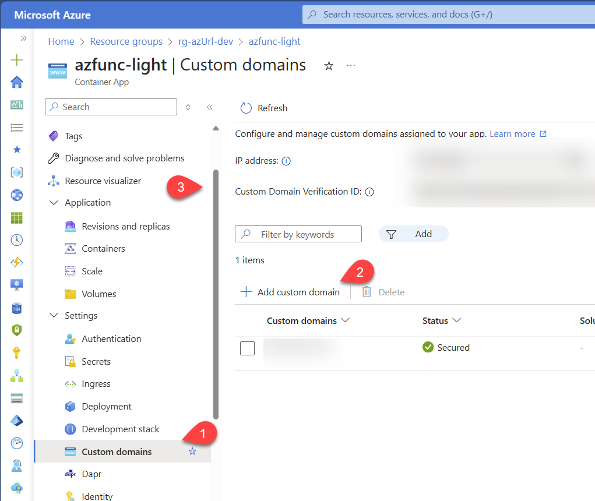

# How to Add a Custom Domain

From the Azure Portal, Open the Azure COntainer Apps named `azfunc-light`. This is the one doing the redirect, this is where you want yout custom domain to be used.

From the left menu, select **Custom domains** and click on **Add custom domain**.

Follow the instructions to add your custom domain. Note that it may takes a few minutes for the domain to all be setup. Once it is, you should see the domain listed in the custom domains list withthe green check mark.

The administration interface is hosted by SharePoint, so it does not need a
separate custom domain. If the administration API domain changes, update the
web part's `apiBaseUrl` property and keep the SharePoint origin in the API CORS
configuration.
