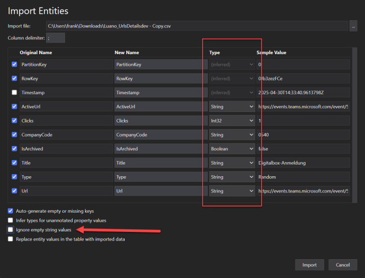

# How to migrate data

Use [Azure Storage Explorer](https://azure.microsoft.com/products/storage/storage-explorer/)
to export and import the tables used by AzUrlShortener.

The deployment creates a storage account for the redirect Function and another
storage account for URL data. Use the account whose name starts with `urldata`.

Export and import these tables:

- `UrlsDetails`, which stores URL definitions and schedules.
- `ClickStats`, which stores click statistics.

When importing:

- Use the same column delimiter as the export.
- Select the correct data type for each column.
- Clear **Ignore empty string values**.

